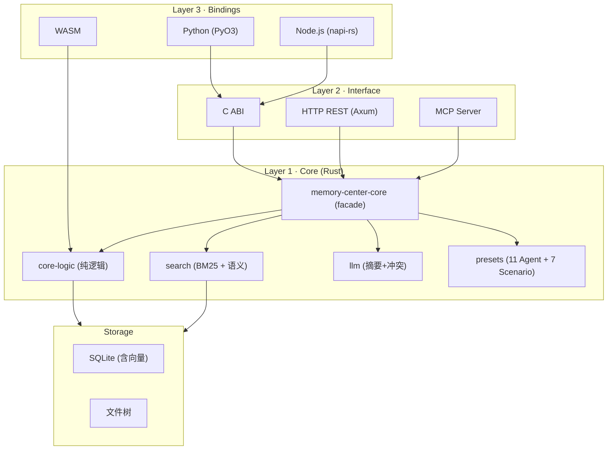
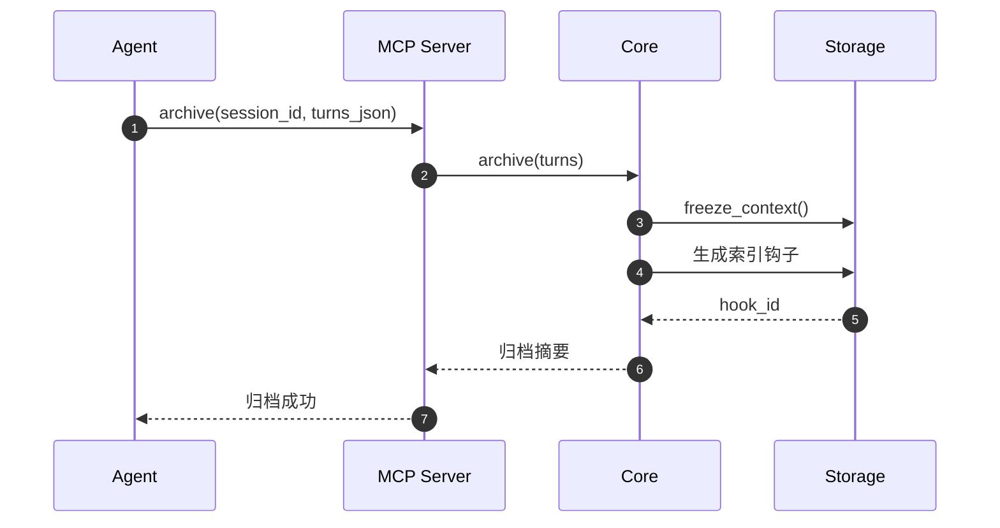
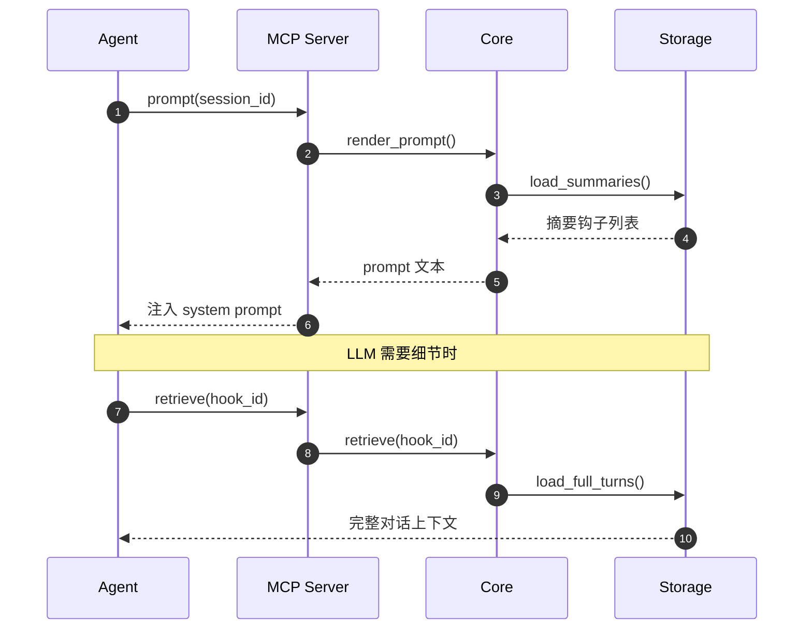

# 整体架构

> 本章节是 [GitHub Wiki: Architecture](https://github.com/LINGTIAN303/MemoryCenter/wiki/Architecture) 的镜像。

## 三层分层架构

```
Layer 3: Bindings       ① Python 原生绑定 (PyO3)  ② WASM 组件  ③ Node/Go/Java
Layer 2: Interface      ① C ABI  ② Axum HTTP REST  ③ MCP stdio  ④ MCP Streamable HTTP
Layer 1: Core (Rust)    纯逻辑 crate（core-logic）+ facade crate（core）
```

## 架构图



## 设计原则

1. **纯逻辑与 IO 分离**：`core-logic` 无 IO 依赖，可编译为 WASM；`core` 作为 facade 整合原生实现
2. **可插拔架构**：`Storage` / `Scorer` / `Migrator` 等 trait 均可替换实现
3. **接入层无状态**：HTTP / MCP server 无状态，水平扩展友好
4. **跨语言一致性**：所有接入方式共享同一组核心操作（archive / retrieve / summaries / prompt / compaction）

## 数据流

### 归档流程



### 检索流程



## 详细文档

完整的架构设计文档见 [docs/ARCHITECTURE.md](https://github.com/LINGTIAN303/MemoryCenter/blob/main/docs/ARCHITECTURE.md)（仓库内）与 [Wiki: Architecture](https://github.com/LINGTIAN303/MemoryCenter/wiki/Architecture)。
